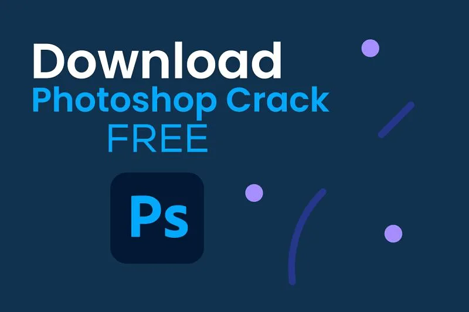
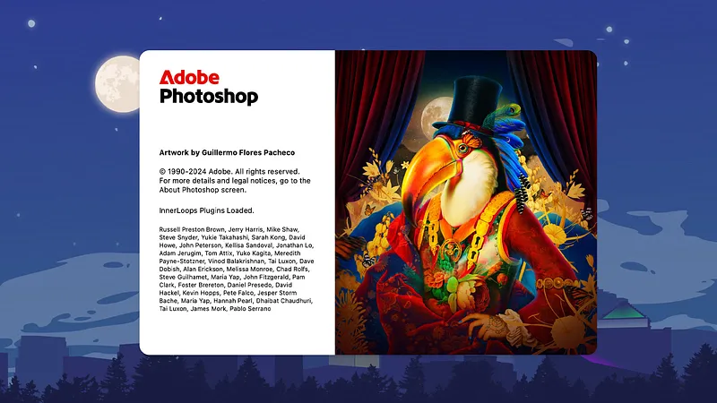

# 🚀 **photoshop crack download** | **adobe photoshop cracked**

Unleash the power of cutting-edge technology with **photoshop crack download**, a solution designed for unmatched **software quality** and rock-solid **reliability**. By integrating advanced features like seamless automation and robust performance monitoring, **photoshop crack download** ensures your projects run smoothly and efficiently, empowering you to focus on what truly matters.

Ready to experience the future of development? Hit the button below to get started!  

## 🛡️ Trust and Reliability with **photoshop crack**

In today's digital world, trust and reliability are paramount. At **photoshop crack**, we take these values seriously and ensure that our platform remains secure, private, and dependable for all users. Here’s how we achieve it:

### Software Security Measures
Our software is built with cutting-edge security protocols to safeguard your data. We employ advanced encryption techniques and multi-layered defenses to protect against unauthorized access.

### Data Protection and Privacy
Your privacy is our priority. **photoshop crack** adheres to strict data protection standards, ensuring that your personal information remains confidential and secure at all times. 🚪🔒

### Regular Security Updates
We understand the importance of staying ahead of potential threats. That's why **photoshop crack** provides regular security updates to address vulnerabilities and enhance system resilience. 💪✨

### Safe Download Process (**adobe photoshop crack**)
When you download **photoshop crack**, rest assured that the process is as secure as possible. Our **adobe photoshop crack** ensures that every installation comes from a verified source, protecting you from malicious actors. 📥✅

### Proven Track Record
With years of experience in the industry, **photoshop crack** has established a proven track record of delivering reliable solutions. Countless users worldwide trust us to keep their data safe and operations running smoothly. 🌍📈

---

### Why Choose **photoshop crack**?
Because we believe in building long-term relationships based on trust and transparency. Whether you're an individual user or part of a large organization, **photoshop crack** guarantees peace of mind through robust security measures and unwavering commitment to excellence.

## Benefits of Using **photoshop cracked**

✨ **Professional Software Capabilities**  
- **photoshop cracked** delivers cutting-edge **adobe photoshop crack** features tailored for professionals, ensuring top-tier performance and reliability. Its robust tools streamline complex workflows, empowering users to achieve their goals efficiently.
- With advanced functionalities built into the core, **photoshop cracked** offers unparalleled precision and control, making it an essential asset for any project.

💻 **User-Friendly Interface**  
- Designed with usability in mind, **photoshop cracked** boasts an intuitive interface that caters to both beginners and experts alike. Navigating through its features is seamless, reducing the learning curve significantly.
- The clean design ensures that users can focus on what matters most without being overwhelmed by unnecessary complexity.

🔄 **Regular Updates and Improvements**  
- Stay ahead of the curve with frequent updates that introduce new **adobe photoshop crack** enhancements and optimizations. Our commitment to continuous improvement guarantees that **photoshop cracked** remains at the forefront of technology.
- These updates ensure compatibility with emerging trends and technologies, providing long-term value to our users.

📞 **Technical Support Availability**  
- Need assistance? Our dedicated support team is always ready to help resolve any issues you may encounter while using **photoshop cracked**. Whether it's troubleshooting or feature guidance, we're here to assist.
- With multiple channels available for communication, getting timely support has never been easier.

---

## 🌟 Support for **adobe photoshop free**

Need help with **adobe photoshop free**? We’ve got you covered! Here's how you can get the support you need:

### 🛠️ Technical Support
Our dedicated team is here to assist you with any technical issues related to **adobe photoshop free**. Whether it's troubleshooting or implementation, we ensure reliable and prompt assistance.

### 📚 Documentation & Resources
Dive into comprehensive guides, tutorials, and FAQs tailored for **adobe photoshop free** users. These resources are regularly updated to keep you informed about the latest features and best practices.

### 💬 Community Forums
Join our vibrant community forums where developers and enthusiasts discuss **photoshop license key**, share insights, and solve problems collaboratively. It’s a great place to learn and contribute!

### ⏳ Updates & Maintenance
We’re committed to maintaining **adobe photoshop free** with regular updates, ensuring compatibility, performance improvements, and security enhancements. Stay up-to-date with our changelog for all the latest changes.

For further assistance or feedback, don’t hesitate to reach out. Your success is our priority!

